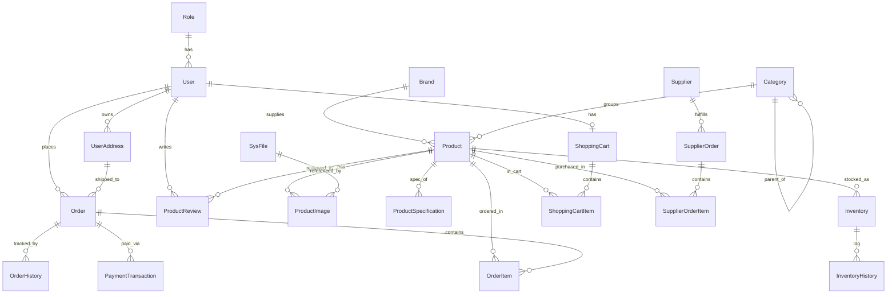

# E-LaptopShop Database — ERD (Current Schema)

> Tự sinh từ EF Core entities + `ApplicationDbContext.OnModelCreating`.
> 21 tables. Phù hợp với SQL Server / Azure SQL Database.

## 1. Sơ đồ quan hệ (Mermaid ERD)

## 2. Tóm tắt các nhóm bảng

| Nhóm | Tables | Mục đích |
| --- | --- | --- |
| **Identity** | `Roles`, `Users`, `UserAddresses` | Tài khoản, phân quyền, địa chỉ giao hàng |
| **Catalog** | `Brands`, `Categories`, `Products`, `ProductImages`, `ProductSpecifications`, `ProductReviews`, `SysFile` | Danh mục hàng hóa & media |
| **Cart & Checkout** | `ShoppingCarts`, `ShoppingCartItems`, `Orders`, `OrderItems`, `OrderHistories`, `PaymentTransactions` | Giỏ hàng → đơn hàng → thanh toán |
| **Inventory** | `Inventories`, `InventoryHistories` | Kho & lịch sử nhập-xuất |
| **Procurement** | `Suppliers`, `SupplierOrders`, `SupplierOrderItems` | Nhập hàng từ NCC |

## 3. Đặc điểm đáng chú ý

- `Category` hỗ trợ cây phân cấp qua `ParentId`, có soft-delete (`IsDeleted`) + `RowVersion` cho optimistic concurrency.
- `User.Email` unique; có cơ chế khóa tài khoản (`IsLocked`, `LockedUntil`, `LoginAttempts`).
- `Product.Slug` unique; chứa `Price`, `Discount`, `InStock` (cache).
- `Inventory` tách riêng để theo dõi nhiều kho (có `Location`) — chuẩn cho multi-warehouse sau này.
- `Order` lưu snapshot price (`SubTotal`, `DiscountAmount`, `TaxAmount`, `ShippingFee`, `TotalAmount`) — đúng best practice.
- `OrderItem` lưu cả `CostPrice`, `SerialNumber` — sẵn sàng cho báo cáo lợi nhuận và bảo hành.

## 4. Các điểm có thể nâng cấp

1. Thiếu **Wishlist / Favorites** — phổ biến cho e-commerce.
2. Thiếu **Coupon / Discount Code** management table — hiện chỉ lưu code rời trên `Order.DiscountCode`.
3. Thiếu **Notifications** & **Audit Log** tổng thể.
4. `ProductReview` chưa có `IsVerifiedPurchase`, `HelpfulCount`, `Reply`.
5. Thiếu **Refund / Return** table riêng (hiện trộn vào enum).
6. Thiếu **Loyalty Points / Membership Tier**.
7. Chưa có **ProductVariant** (cùng laptop nhưng khác cấu hình) — nâng cấp lớn nếu muốn đi sâu.
8. Chưa có **Search Index Sync** / **Tag** linh hoạt.

→ Các điểm này sẽ được bổ sung trong `02_schema_upgrade.sql`.
